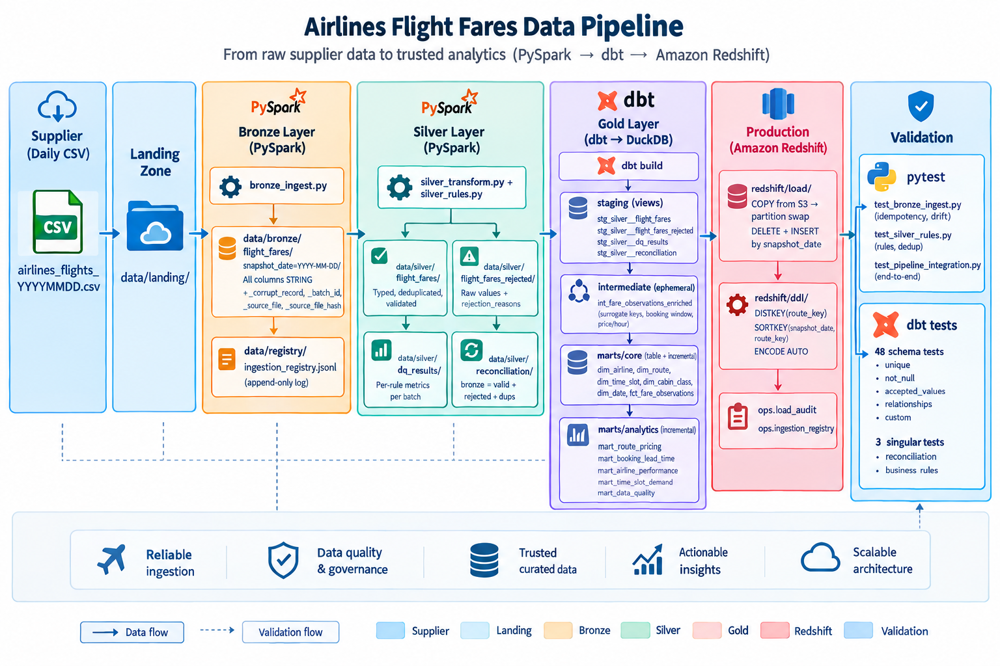

# Airline Fare Data Pipeline – Medallion Architecture

End-to-end pipeline that turns the supplied `airlines_flights_data.csv` (300,153 fare
observations) into analytics-ready datasets:

**CSV → Bronze (PySpark) → Silver (PySpark) → Gold (dbt) → Amazon Redshift**

Locally dbt targets DuckDB; the same models deploy to Redshift by switching the dbt
target. Redshift DDL and load scripts are included (no live cluster required by the
brief).

---

## 1. Quick start

Prerequisites: Python 3.12, JDK 17 on `PATH`.

```bash
pip install -r requirements.txt
bash scripts/run_pipeline.sh full




